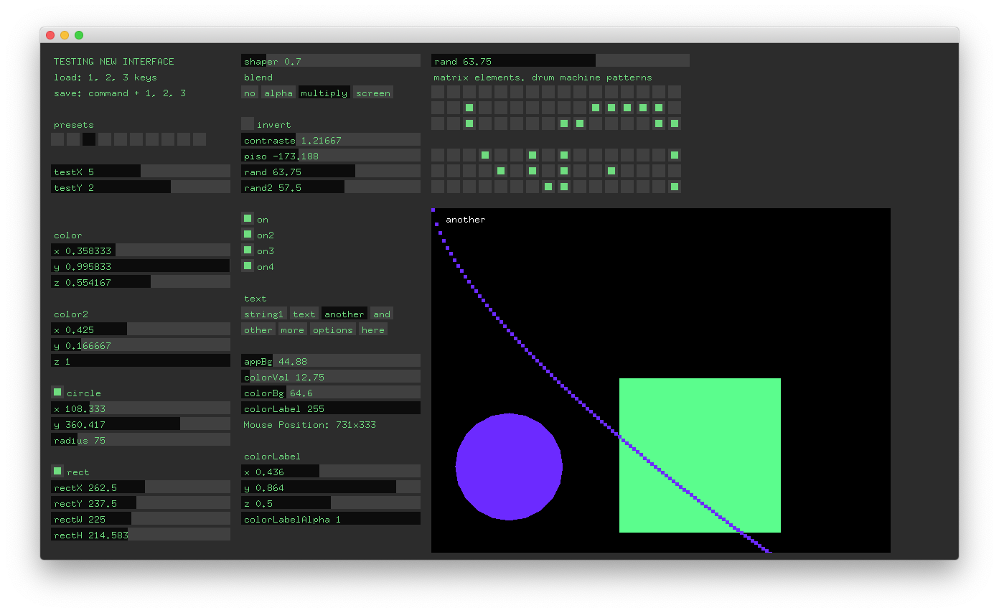

# MICROUI

UI for OpenFrameworks.  
Made to be a compact user interface for software.

## Text Files for interface.
UI Elements (sliders, toggles, etc) are loaded from a text file.  
So it is easy to copy paste, cut, paste somewhere else, change column, copy interfaces between softwares
and change layout things without recompile anything. Fast prototyping.
If you have a finished software and don't want external files you can stringify everything to be hard coded.  
Now working on ofxMicroUIRemote which mirrors and syncronize the interface in another device using osc.  
This is the interface I've been using for all my openFrameworks projects.  
  
Dimitre